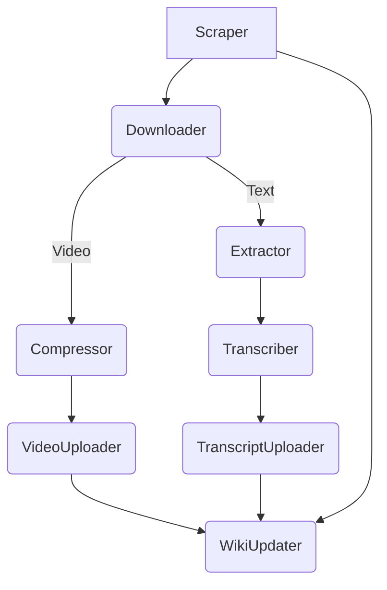

# Transparent Clayton
## Daily CC Video processing pipeline

```mermaid
flowchart TD
    A[Scraper] --> B(Downloader)
    B -->|Video| C(Compressor)
    C -->D(VideoUploader)
    B -->|Text| E(Extractor)
    E --> F(Transcriber)
    F --> G(TranscriptUploader)
    D --> H(WikiUpdater)
    G --> H(WikiUpdater)
    A --> H(WikiUpdater)
```

## Unit Tests
`pipenv run python -m unittest discover`
