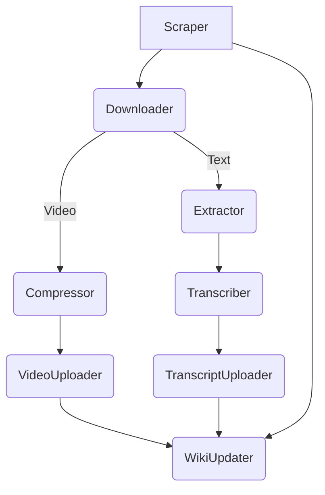

# Transparent Clayton
## Daily CC Video processing pipeline
1. Scrape city council page for recent meetings to download
2. Download city council meeting video
3. Compress downloaded video
4. Upload compressed video to YouTube
5. Extract the audio for transcription
6. Upload extracted audio to be transcribed by AssemblyAI
7. Publish google doc with downloaded transcript
8. Manual-- Publish updated links to City Council wiki
9. Manual-- get AI summary of transcript and update meeting wiki

## Unit Tests
- should be running pre-push
